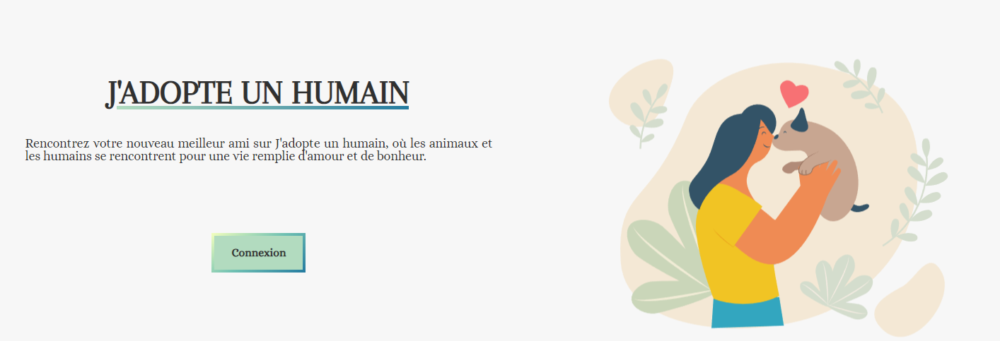

# J'adopte un humain FRONT-END

[https://j-adopte-un-humain.netlify.app/](https://j-adopte-un-humain.netlify.app/)

# Contexte

Projet de fin de formation, dans le but de mettre en pratique les connaissances que nous avons acquises en développant une application fonctionnelle.

# Technologies utilisées

- HTML5, CSS3, Sass
- JavaScript, React, Axios
- Nodejs, Express
- PostgreSQL
- Bcrypt : Sécuriser les mots de passe en les hachants
- JSON Web Token : Permet de créer, signer et vérifier les JSON Web Tokens pour l'authentification
- Winston : Journalisation pour enregistrer des informations et des erreurs
- Joi : Validation des données selon des schémas définis
- Swagger : Outil pour concevoir, documenter et tester l'API